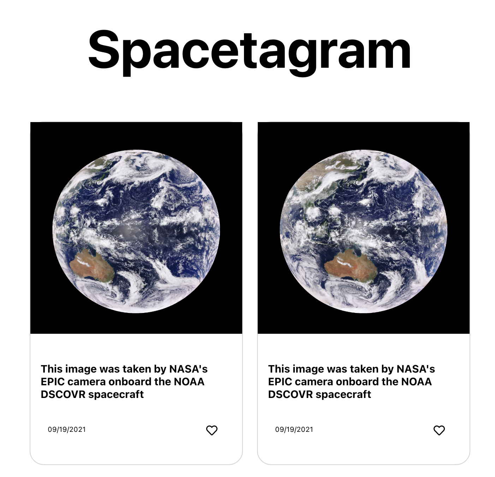

# Shopify Winter Challenge | Spacestagram

Spacestagram helps users view images taken in space. Images can be liked and unliked. The app utilizes NASA's EPIC DAILY “BLUE MARBLE” API.



## Technologies Used

- HTML5
- CSS3
- JavaScript (ES6)
- React
- Git

## Try it out!

[Live site here](https://unruffled-kare-f2c6fc.netlify.app/)

## Getting Started

1. Clone this repository.

```
git clone https://github.com/katelyndevine/pacman-react.git
```

2. Install the dependencies located in the package.json file.

```
npm install
```

3. Start the app; this command runs the app in the development mode. Open http://localhost:3000 to view it in the browser.

```
npm start
```
